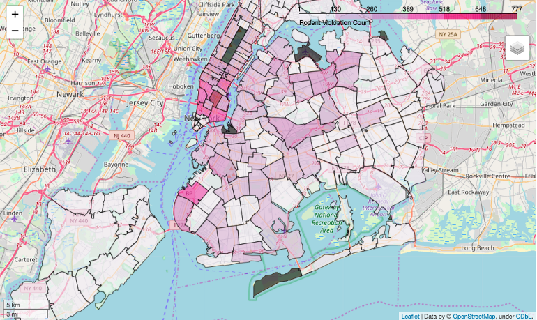
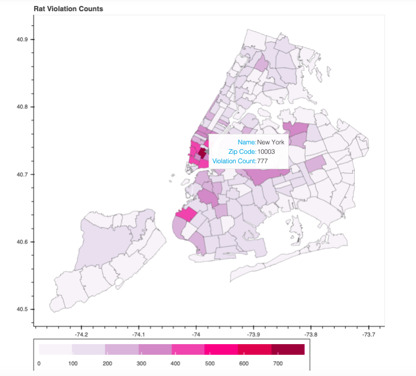

## You Probably Shouldn't Be Using Folium
This is the companion GitHub to a blog I wrote on [Medium](https://medium.com/@cjriggio3/you-probably-shouldnt-be-using-folium-94913e16797a) with the same title. In it I give a detailed break down of how and why you should use Bokeh and not Folium to make interactive heatmaps. This heatmap was a key visualization in a project that my partner and I did on [NYC Restaurant Inspection Data](
https://github.com/robblatt/Restaurant-Hypothesis-Testing) at the Flatiron School for Data Science, in which we wanted to take a look at the number of rodent related complaints via 311 by zipcode. 

### Using Folium:

### Using Bokeh:

